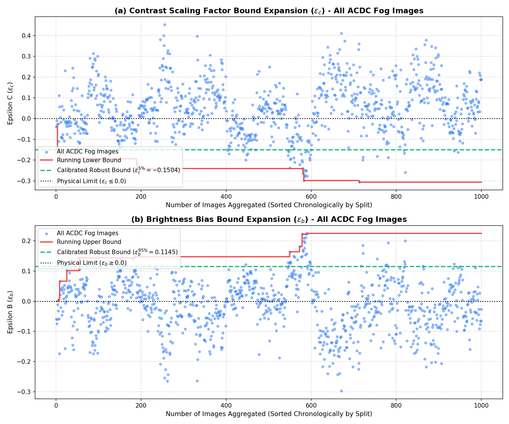
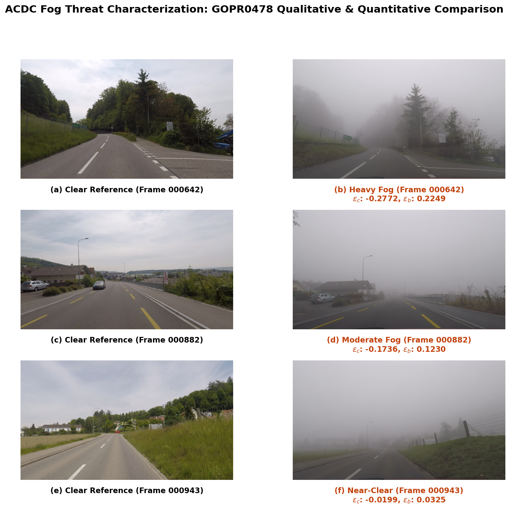

# ACDC Fog Threat Characterization & Epsilon Bound Analysis

This report documents the physical threat characterization of fog on camera images using the **ACDC (Adverse Conditions Dataset with Clear References)** dataset. It details the math behind the threat model, physical limits, and bound calibration for the **SDP-CROWN** safety verification bounds.

---

## 1. Physical Threat Model & Physical Clipping Bounds

In atmospheric physics, fog affects camera sensors through two primary mechanisms:
1. **Light Attenuation:** Scatters light reflected from objects, leading to a **contrast drop**.
2. **Atmospheric Backscattering:** Reflected ambient light from the fog particles themselves, adding a **brightness glow**.

Mathematically, this is modeled as an **affine pixel transformation** mapping a clear weather reference image $x_{\text{clear}}$ to a foggy image $x_{\text{fog}}$:

$$x_{\text{fog}} \approx (1 + \epsilon_c) \cdot x_{\text{clear}} + \epsilon_b$$

### Physical Constraints & Noise Clipping
To represent true fog physics, the parameters must adhere to strict physical boundaries. Anything violating these bounds is non-physical noise (e.g., local shadows, passing vehicles, exposure shifts):

- **Contrast Scaling Limit ($\epsilon_c \leq 0.0$):** Fog always *attenuates* light and reduces contrast. It is physically impossible for fog to *increase* contrast. Therefore, any calculated $\epsilon_c > 0.0$ is clipped to $0.0$.
- **Brightness Bias Limit ($\epsilon_b \geq 0.0$):** Atmospheric backscattering always *adds* ambient light and increases brightness. It is physically impossible for fog to *decrease* ambient brightness. Therefore, any calculated $\epsilon_b < 0.0$ is clipped to $0.0$.

In the plotting environment:
- **For Epsilon C ($\epsilon_c$):** We plot the running lower bound line and shade up to $0.0$.
- **For Epsilon B ($\epsilon_b$):** We plot the running upper bound line and shade down to $0.0$.

---

## 2. Combined Dataset Epsilon Bound Expansion (All 1,000 Images)

By running a cumulative scan over **all 1,000 images** sorted in split order (**train $\rightarrow$ test $\rightarrow$ val**), we compute the bounds. 

To filter out transient outlier noise, we extract the robust **5th percentile** for the contrast drop ($\epsilon_c$) and the **95th percentile** for the brightness bias ($\epsilon_b$):

- **Calibrated Contrast Scaling Bound ($\epsilon_c^{5\%}$):** $-0.1504$
- **Calibrated Brightness Bias Bound ($\epsilon_b^{95\%}$):** $0.1145$

Below is the cumulative dataset expansion plot showing the running bounds and the calibrated robust percentile lines:

> [!NOTE]
> The horizontal black dotted lines at $y=0.0$ represent the **Physical Limits** ($\epsilon_c \leq 0.0$ and $\epsilon_b \geq 0.0$). The green dashed lines indicate the robust percentile boundaries.
> The raw data is stored in the persistent JSON file:
> [fog_epsilon_expansion_analysis_combined.json](fog_epsilon_expansion_analysis_combined.json)
> The python plotting script is stored in the results folder:
> [generate_fog_plots.py](generate_fog_plots.py)

---

## 3. Qualitative Side-by-Side Comparison

Below is the side-by-side color comparison grid for **3 representative frames** in GOPR0478 that capture the clearing-fog transition, labeled with subfigure tags **(a)** through **(f)** to match IEEEtran scientific standard:

### Qualitative Discussion:
1. **Heavy Fog (Frame 000642):** Subfigures **(a)** and **(b)** show clear reference and heavy fog conditions, characterized by an extreme contrast loss ($\epsilon_c = -0.2772$) and a heavy atmospheric glow ($\epsilon_b = 0.2249$). Notice that the road markings, lane boundaries, and distant objects are heavily obscured by the backscatter.
2. **Moderate Fog (Frame 000882):** Subfigures **(c)** and **(d)** show clear reference and moderate fog, with a moderate contrast recovery ($\epsilon_c = -0.1736$) and a reduced glow ($\epsilon_b = 0.1230$). Distant features begin to outline, indicating the fog is starting to dissipate.
3. **Near-Clear Weather (Frame 000943):** Subfigures **(e)** and **(f)** show clear reference and near-clear weather, where epsilon values are near-zero ($\epsilon_c = -0.0199$, $\epsilon_b = 0.0325$), corresponding to a near-complete clearing of the fog. Visual contrast and object boundaries closely match the clear reference image.
