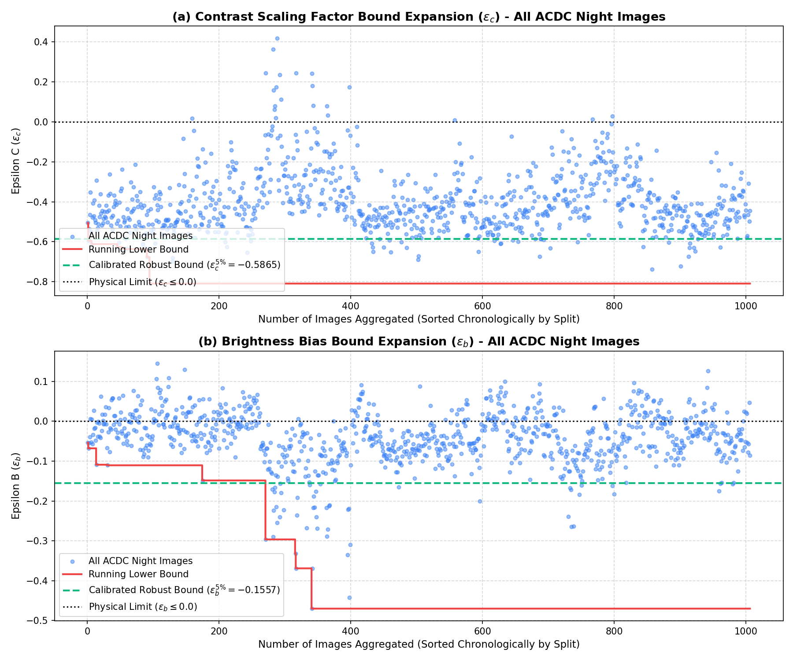
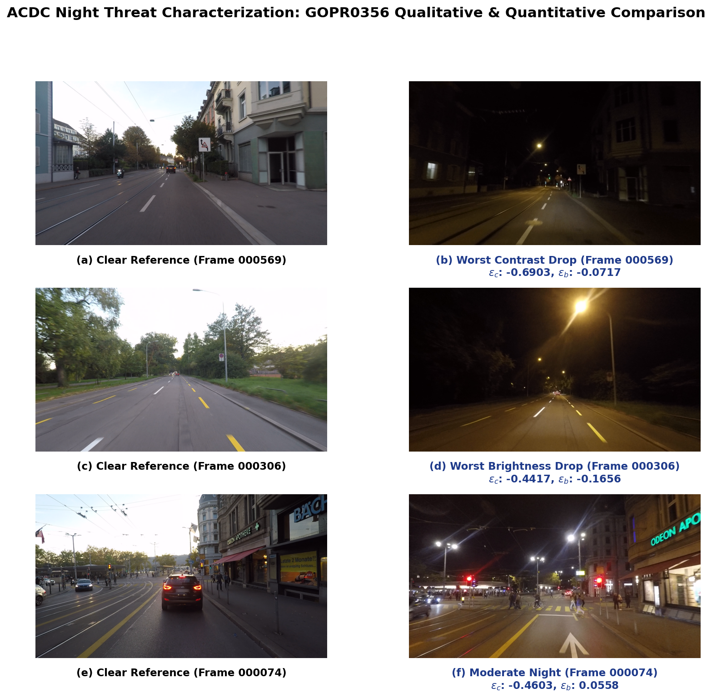

# ACDC Night Threat Characterization & Epsilon Bound Analysis

This report documents the physical threat characterization of nighttime conditions on camera images using the **ACDC (Adverse Conditions Dataset with Clear References)** dataset. It details the math behind the threat model, physical limits, and bound calibration for the **SDP-CROWN** safety verification bounds.

---

## 1. Night Threat Model & Physical Clipping Bounds

For nighttime conditions, the ambient illumination is globally reduced compared to the clear weather daytime reference images. This is modeled using the same affine semantic perturbation layer mapping clear reference images $x_{\text{clear}}$ to nighttime images $x_{\text{night}}$:

$$x_{\text{night}} \approx (1 + \epsilon_c) \cdot x_{\text{clear}} + \epsilon_b$$

### Physical Constraints & Noise Clipping
Because night always reduces contrast and decreases brightness:
- **Contrast Scaling Limit ($\epsilon_c \leq 0.0$):** Contrast cannot increase. Any computed $\epsilon_c > 0.0$ is clipped to $0.0$.
- **Brightness Bias Limit ($\epsilon_b \leq 0.0$):** Night always *reduces* baseline luminance. Brightness bias cannot be positive. Therefore, any computed $\epsilon_b > 0.0$ is clipped to $0.0$.

*Note on Localized Light Sources:*
Real nighttime images contain localized artificial light sources such as streetlamps, oncoming headlights, and reflective signs. These act as high-contrast hotspots and local brightness peaks on top of the ambient nighttime darkness. In our global affine model, these light sources manifest as positive excursions in the calculated parameters. However, including these in our formal verification bounds would imply that driving at night globally increases visibility, which is physically false. To isolate the global safety-critical ambient darkness, any positive excursions are clipped to $0.0$, capturing only the ambient degradation.

In the plotting environment:
- **For Epsilon C ($\epsilon_c$):** We plot the running lower bound line and shade up to $0.0$.
- **For Epsilon B ($\epsilon_b$):** We plot the running lower bound line and shade up to $0.0$.

---

## 2. Combined Dataset Night Bound Expansion (All 1,006 Images)

By running a cumulative scan over **all 1,006 images** sorted in split order (**train $\rightarrow$ test $\rightarrow$ val**), we compute the bounds. 

To filter out transient outlier noise, we extract the robust **5th percentile** for the contrast drop ($\epsilon_c$) and the **5th percentile** for the brightness bias drop ($\epsilon_b$):

- **Calibrated Contrast Scaling Bound ($\epsilon_c^{5\%}$):** $-0.5865$
- **Calibrated Brightness Bias Bound ($\epsilon_b^{5\%}$):** $-0.1557$

Below is the cumulative dataset expansion plot showing the running bounds and the calibrated robust percentile lines:

> [!NOTE]
> The horizontal black dotted lines at $y=0.0$ represent the **Physical Limits** ($\epsilon_c \leq 0.0$ and $\epsilon_b \leq 0.0$). The green dashed lines indicate the robust percentile boundaries.
> The raw data is stored in the persistent JSON file:
> [night_epsilon_expansion_analysis_combined.json](night_epsilon_expansion_analysis_combined.json)
> The python plotting script is stored in the results folder:
> [generate_night_plots.py](generate_night_plots.py)

---

## 3. Qualitative Side-by-Side Comparison

Below is the side-by-side color comparison grid for **3 representative frames** in GOPR0356, labeled with subfigure tags **(a)** through **(f)** to match IEEEtran scientific standard:

### Qualitative Discussion:
1. **Worst Contrast Drop (Frame 000569):** Subfigures **(a)** and **(b)** show clear reference and nighttime conditions, characterized by extreme contrast drop ($\epsilon_c = -0.6903, \epsilon_b = -0.0717$). The road outline is extremely dim and contrast is washed out.
2. **Worst Brightness Drop (Frame 000306):** Subfigures **(c)** and **(d)** show clear reference and heavy darkness, with maximum brightness drop ($\epsilon_c = -0.4417, \epsilon_b = -0.1656$).
3. **Moderate Night (Frame 000074):** Subfigures **(e)** and **(f)** show clear reference and moderate nighttime condition ($\epsilon_c = -0.4603, \epsilon_b = 0.0558$).
