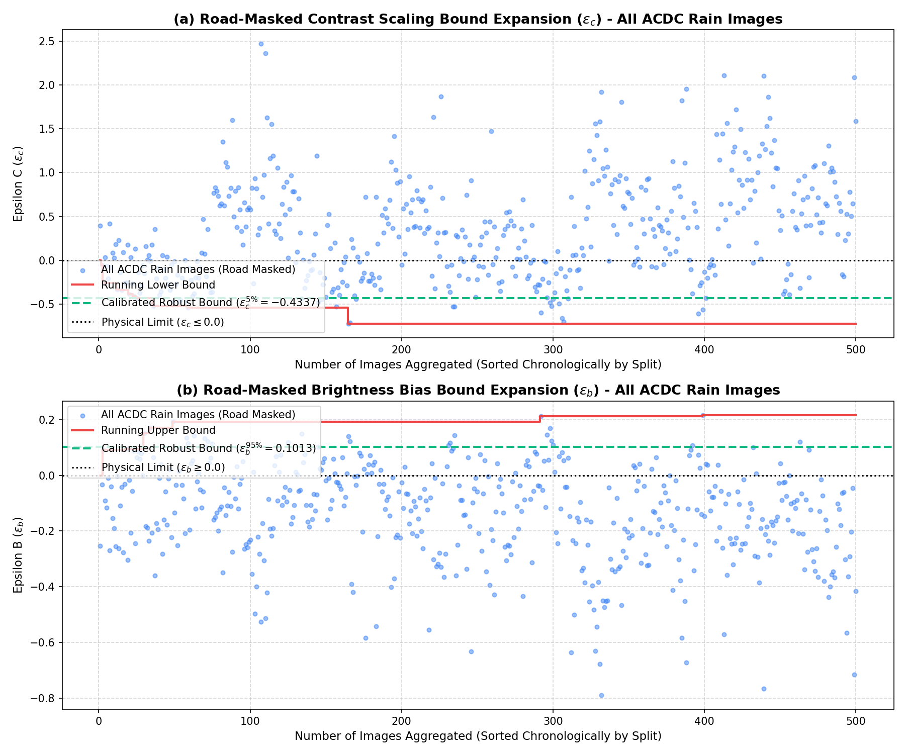
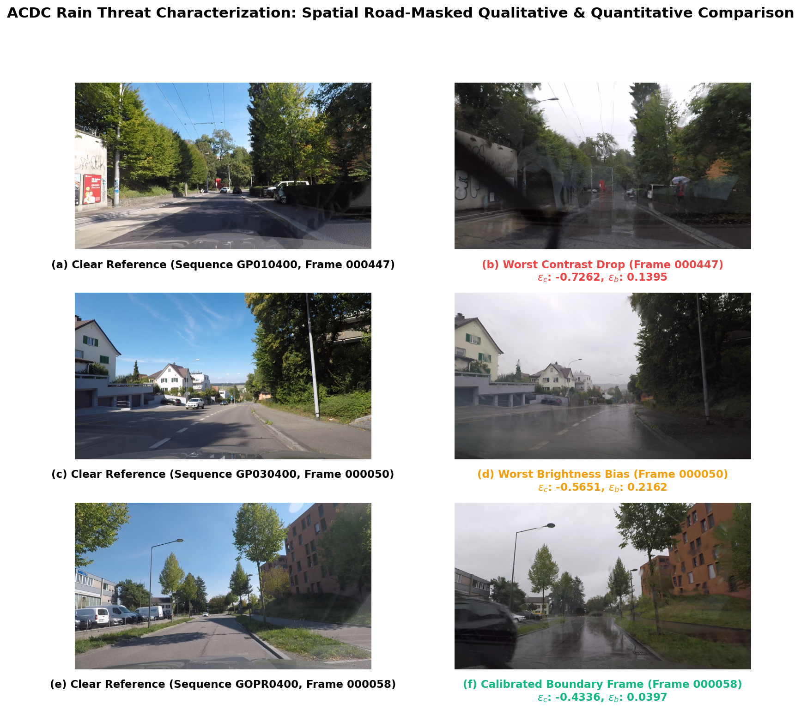

# ACDC Rain Threat Characterization & Epsilon Bound Analysis

This report documents the physical threat characterization of rain on camera images using the **ACDC (Adverse Conditions Dataset with Clear References)** dataset. It details the spatial masking approach, mathematical model, physical limits, and bound calibration for the **SDP-CROWN** safety verification bounds.

---

## 1. Physical Threat Model & Spatial Road Masking

In wet weather conditions, rain affects the camera sensor primarily through **wet asphalt specular glare** and reflections from water buildup, alongside pavement darkening. To isolate this safety-critical degradation of the road surface itself, we apply **spatial road masking**.

We utilize the ACDC ground truth segmentations (`gt`) and isolate pixels belonging to the road class (**class ID 0**). The affine pixel transformation is then calibrated only over these road pixels:

$$x_{\text{rain}}[M_{\text{road}}] \approx (1 + \epsilon_c) \cdot x_{\text{clear}}[M_{\text{road}}] + \epsilon_b$$

### The Rationale for Spatial Masking (Rain vs. Fog/Night)
- **Rain (Masked):** Wet asphalt acts as a dark mirror, causing extreme specular reflections from headlights and streetlights (which mimic or wash out lane lines) and lowering baseline pavement reflectivity. However, other portions of the scene (like buildings, trees, and sky) do not exhibit these wet specular reflections. Masking the road is critical to avoid washing out the parameters and underestimating the reflection glare on the asphalt.
- **Fog (Unmasked/Global):** Fog is an atmospheric scattering phenomenon that globally attenuates light across the entire scene, including the background and sky.
- **Night (Unmasked/Global):** Nighttime represents a global reduction in ambient illumination across the entire field of view.

---

## 2. Combined Dataset Rain Bound Expansion (All 500 Images)

By running a cumulative scan over **all 500 rain image pairs** sorted in split order (**train $\rightarrow$ test $\rightarrow$ val**), we compute the bounds. 

To filter out transient outlier noise (such as passing vehicles or extreme exposure adjustments), we extract the robust **5th percentile** for the contrast drop ($\epsilon_c$) and the **95th percentile** for the brightness bias ($\epsilon_b$):

- **Calibrated Contrast Scaling Bound ($\epsilon_c^{5\%}$):** $-0.4337$
- **Calibrated Brightness Bias Bound ($\epsilon_b^{95\%}$):** $0.1013$

Below is the cumulative dataset expansion plot showing the running bounds and the calibrated robust percentile lines:

> [!NOTE]
> The horizontal black dotted lines at $y=0.0$ represent the **Physical Limits** ($\epsilon_c \leq 0.0$ and $\epsilon_b \geq 0.0$). The green dashed lines indicate the robust percentile boundaries.
> The raw data is stored in the persistent JSON file:
> [rain_epsilon_expansion_analysis_combined.json](rain_epsilon_expansion_analysis_combined.json)
> The python plotting script is stored in the results folder:
> [generate_rain_plots.py](generate_rain_plots.py)

---

## 3. Qualitative Side-by-Side Comparison

Below is the side-by-side color comparison grid for **3 representative frames** in the rain split, labeled with subfigure tags **(a)** through **(f)** to match IEEEtran scientific standard:

### Qualitative Discussion:
1. **Worst Contrast Drop (Sequence GP010400, Frame 000447):** Subfigures **(a)** and **(b)** show clear reference and heavy rain conditions, characterized by an extreme contrast loss ($\epsilon_c = -0.7262$) on the road surface due to water film reflections and heavy pavement darkening.
2. **Worst Brightness Bias (Sequence GP030400, Frame 000050):** Subfigures **(c)** and **(d)** show clear reference and heavy wet reflection, with a significant brightness increase ($\epsilon_b = 0.2162$) on the road surface due to specular reflections of overhead light sources.
3. **Calibrated Boundary Frame (Sequence GOPR0400, Frame 000058):** Subfigures **(e)** and **(f)** represent a typical rain condition near the calibrated 5th percentile boundary ($\epsilon_c = -0.4336$, $\epsilon_b = 0.0397$), representing a realistic, moderate wet road condition.
