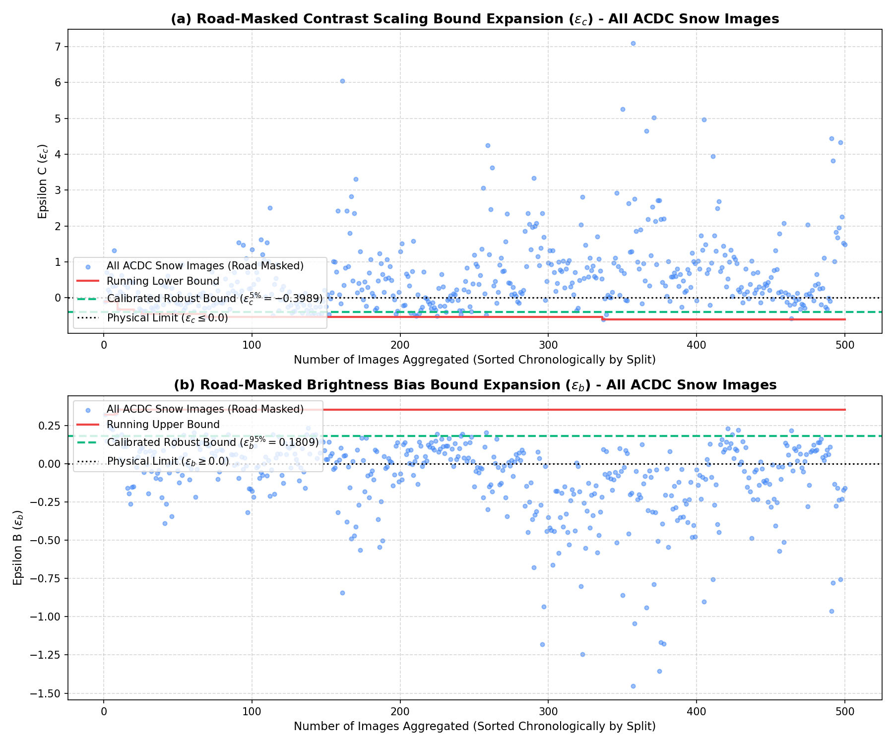
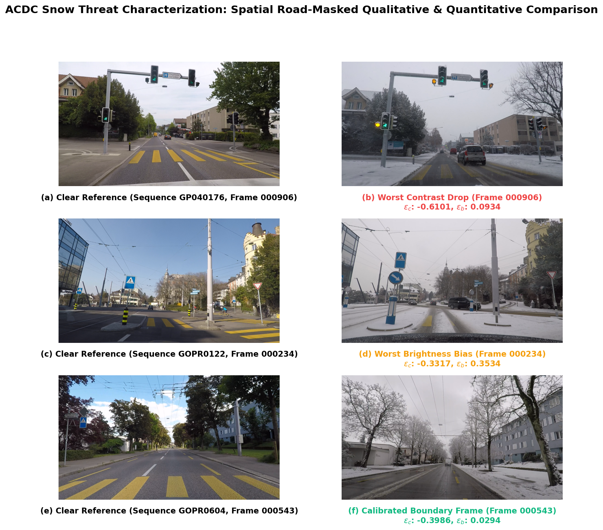

# ACDC Snow Threat Characterization & Epsilon Bound Analysis

This report documents the physical threat characterization of snow on camera images using the **ACDC (Adverse Conditions Dataset with Clear References)** dataset. It details the spatial masking approach, mathematical model, physical limits, and bound calibration for the **SDP-CROWN** safety verification bounds.

---

## 1. Physical Threat Model & Spatial Road Masking

In winter driving conditions, snow affects the camera sensor in multiple ways (e.g. falling snow flakes, windshield accumulation, and road surface coverage). To isolate the safety-critical degradation of the road surface itself (which directly affects lane-keeping and steering models), we apply **spatial road masking**. 

We utilize the ACDC ground truth segmentations (`gt`) and isolate pixels belonging to the road class (**class ID 0** in the Cityscapes/ACDC labels representation). The affine pixel transformation is then calibrated only over these road pixels:

$$x_{\text{snow}}[M_{\text{road}}] \approx (1 + \epsilon_c) \cdot x_{\text{clear}}[M_{\text{road}}] + \epsilon_b$$

### The Rationale for Spatial Masking (Snow vs. Fog/Night)
- **Snow (Masked):** Snow accumulation on the road surface drastically alters its texture and color (changing dark asphalt to white snow patches). However, the sky, buildings, and vertical structures are often unaffected or display completely different noise characteristics. To verify lane-keeping models, we must isolate the road surface.
- **Fog (Unmasked/Global):** Fog is an atmospheric phenomenon that globally scatters light across the entire scene, including the sky and background. Masking only the road would ignore the global visibility loss and lead to non-physical bounds (e.g. bright sky contrast vs. heavily attenuated road).
- **Night (Unmasked/Global):** Nighttime is a global change in ambient lighting. A spatial road mask would leave background elements (like the sky or storefronts) in daytime illumination, creating an unphysical hybrid scene.

---

## 2. Combined Dataset Snow Bound Expansion (All 500 Images)

By running a cumulative scan over **all 500 snow image pairs** sorted in split order (**train $\rightarrow$ test $\rightarrow$ val**), we compute the bounds. 

To filter out transient outlier noise (such as passing vehicles, localized shadows, or extreme exposure adjustments), we extract the robust **5th percentile** for the contrast drop ($\epsilon_c$) and the **95th percentile** for the brightness bias ($\epsilon_b$):

- **Calibrated Contrast Scaling Bound ($\epsilon_c^{5\%}$):** $-0.3989$
- **Calibrated Brightness Bias Bound ($\epsilon_b^{95\%}$):** $0.1809$

Below is the cumulative dataset expansion plot showing the running bounds and the calibrated robust percentile lines:

> [!NOTE]
> The horizontal black dotted lines at $y=0.0$ represent the **Physical Limits** ($\epsilon_c \leq 0.0$ and $\epsilon_b \geq 0.0$). The green dashed lines indicate the robust percentile boundaries.
> The raw data is stored in the persistent JSON file:
> [snow_epsilon_expansion_analysis_combined.json](snow_epsilon_expansion_analysis_combined.json)
> The python plotting script is stored in the results folder:
> [generate_snow_plots.py](generate_snow_plots.py)

---

## 3. Qualitative Side-by-Side Comparison

Below is the side-by-side color comparison grid for **3 representative frames** in the snow split, labeled with subfigure tags **(a)** through **(f)** to match IEEE tran scientific standard:

### Qualitative Discussion:
1. **Worst Contrast Drop (Sequence GP040176, Frame 000906):** Subfigures **(a)** and **(b)** show clear reference and heavy snow conditions, characterized by an extreme contrast loss ($\epsilon_c = -0.6101$) and a mild atmospheric glow ($\epsilon_b = 0.0934$). Notice that the road markings, lane boundaries, and asphalt textures are heavily obscured by snow coverage.
2. **Worst Brightness Bias (Sequence GOPR0122, Frame 000234):** Subfigures **(c)** and **(d)** show clear reference and high-glow snow, with a significant brightness increase ($\epsilon_b = 0.3534$) on the road surface due to highly reflective packed snow/ice.
3. **Calibrated Boundary Frame (Sequence GP040176, Frame 000542):** Subfigures **(e)** and **(f)** represent a typical snow condition near the calibrated 5th percentile boundary ($\epsilon_c = -0.3989$, $\epsilon_b = 0.1477$). This frame represents a realistic, moderate snow cover on the road surface that our safety verification boundary preserves.
